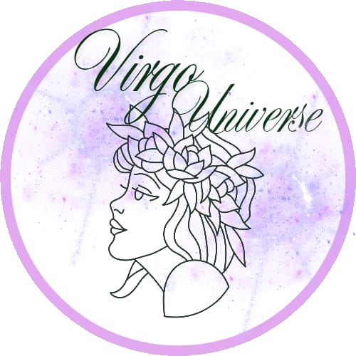
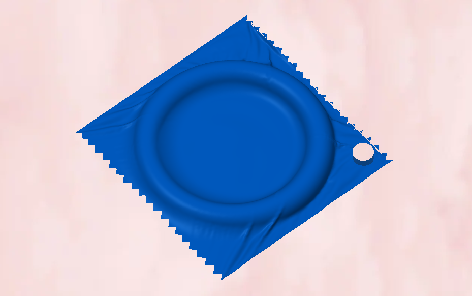
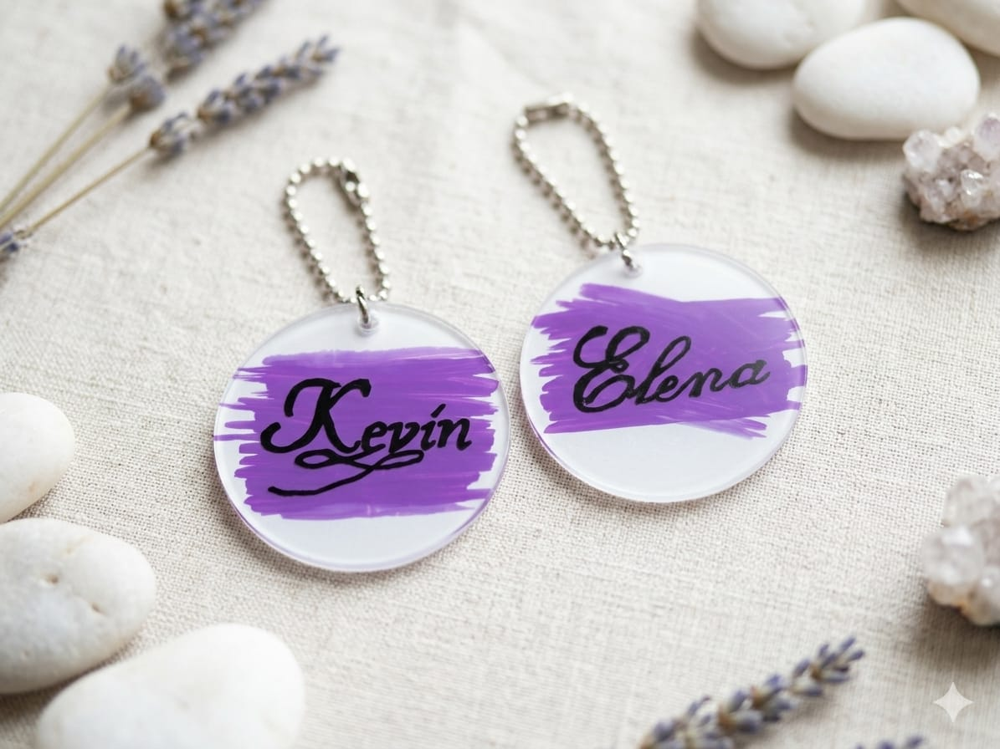

<!doctype html>
<html lang="it" class="h-full">
 <head>
  <meta charset="UTF-8">
  <meta name="viewport" content="width=device-width, initial-scale=1.0">
  <title>Virgo Universe</title>
  
  
  
  <link href="https://fonts.googleapis.com/css2?family=DM+Sans:wght@400;500;600;700&display=swap" rel="stylesheet">
 
  
  
 </head>
 <body class="h-full overflow-auto bg-[#FAF5FF] text-purple-950">
  

   <header id="header" class="bg-[#E9D5FF] text-purple-950 sticky top-0 z-50">
    

     
     

      
      Virgo Universe
     

     

      <button onclick="toggleCart()" class="relative p-2 hover:bg-purple-300 rounded-lg transition">
       <i data-lucide="shopping-cart" style="width:20px;height:20px"></i>
       0
      </button>
     

     

      

       <input id="search-input" type="text" placeholder="Cerca oggetti 3D..." class="w-full pl-4 pr-10 py-2 rounded-lg text-gray-900 text-sm focus:outline-none focus:ring-2 focus:ring-purple-400 border border-purple-200 shadow-sm"> 
       <button onclick="filterProducts()" class="absolute right-2 top-1/2 -translate-y-1/2 text-gray-400 hover:text-purple-600">
        <i data-lucide="search" style="width:18px;height:18px"></i>
       </button>
      

     

    

   </header>

   

    

        <button onclick="setCategory('all')" class="cat-btn whitespace-nowrap text-purple-700 font-bold underline underline-offset-4">Tutti</button>
        <button onclick="setCategory('casa')" class="cat-btn whitespace-nowrap text-purple-500 hover:text-purple-800 transition">Casa & Decor</button>
        <button onclick="setCategory('gadget')" class="cat-btn whitespace-nowrap text-purple-500 hover:text-purple-800 transition">Gadget & Tech</button>
        <button onclick="setCategory('giochi')" class="cat-btn whitespace-nowrap text-purple-500 hover:text-purple-800 transition">Giochi & Hobby</button>
        <button onclick="setCategory('adulti')" class="cat-btn whitespace-nowrap text-purple-500 hover:text-purple-800 transition">Adulti</button>
        <button onclick="setCategory('arte')" class="cat-btn whitespace-nowrap text-purple-500 hover:text-purple-800 transition">Arte & Design</button>
    

   

   <section class="bg-gradient-to-r from-[#E9D5FF] via-[#F3E8FF] to-[#E9D5FF] text-purple-950 py-8 px-4 border-b border-purple-100">
    

     <h1 id="hero-text" class="text-2xl md:text-3xl font-bold mb-2">Trova oggetti personalizzati</h1>
     
Idee Originali • Vasta Scelta • Materiali eco-friendly

    

   </section>
   
   <main class="flex-1 max-w-7xl mx-auto px-4 py-6 w-full">
    

     

     
     <select id="sort-select" onchange="sortProducts()" class="text-sm border border-purple-200 rounded-lg px-3 py-1.5 focus:outline-none focus:ring-2 focus:ring-purple-400 bg-white text-purple-900 shadow-sm cursor-pointer"> 
         <option value="price-low">Prezzo: basso → alto</option> 
         <option value="price-high">Prezzo: alto → basso</option> 
     </select>
     
    

    

   </main>

   

   

    

     <h2 class="font-bold text-lg text-purple-950">Carrello</h2><button onclick="toggleCart()" class="p-1 hover:bg-purple-200 text-purple-700 rounded transition"><i data-lucide="x" style="width:20px;height:20px"></i></button>
    

    

    

     
Totale€0,00
     
<button onclick="sendToWhatsApp()" class="w-full bg-[#C084FC] text-white py-2.5 rounded-lg font-medium hover:bg-[#A855F7] transition flex items-center justify-center gap-2 shadow-sm"><i data-lucide="send" style="width:18px;height:18px"></i>Invia su WhatsApp</button>
    

   

  

  
 </body>

<!-- Footer Informativo -->
    <footer class="mt-auto py-8 text-center text-purple-400 text-xs px-4 border-t border-purple-100">
        

            Questo sito è una vetrina virtuale. Non viene effettuata alcuna raccolta o memorizzazione di dati personali. 
            La comunicazione avviene tramite WhatsApp per la sola finalità di gestione degli ordini.
        

    </footer>

    <!-- Posiziona il footer prima del tag di chiusura -->
</body>

</html># VirgoUniverse.github.io
